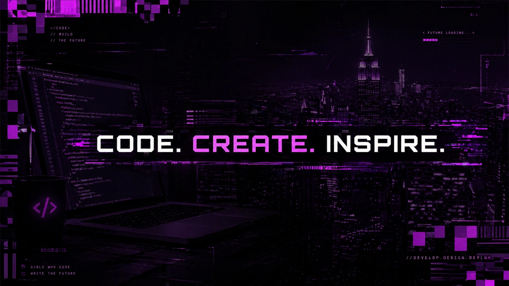

  

Hi there, I'm Yulia 👋
- 🔭 I’m currently working on various projects to improve my skills
- 🌱 I’m currently studying everything I need to bring my ideas to life
- 🤔 I'm looking for help with finding more time in a single day

<!--
**YuliaPelia/YuliaPelia** is a ✨ _special_ ✨ repository because its `README.md` (this file) appears on your GitHub profile.

Here are some ideas to get you started:

- 🔭 I’m currently working on ...
- 🌱 I’m currently learning ...
- 👯 I’m looking to collaborate on ...
- 🤔 I’m looking for help with ...
- 💬 Ask me about ...
- 📫 How to reach me: ...
- 😄 Pronouns: ...
- ⚡ Fun fact: ...
My stack:

-->

