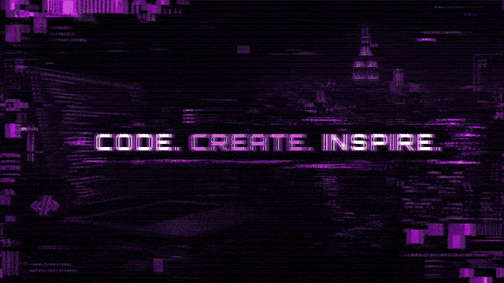

  

<h1 align="center">Hey, I'm Yulia — I turn caffeine into clean UI ✨</h1>

<p align="center">
Frontend Engineer • React / Next.js • UI/UX lover  
</p>
<p align="center">
  <a href="https://portfolio-peliachyk-yulia.vercel.app/en/" target="_blank">
    
  </a>
</p>


## 🧠 System Info

```bash
> role: Frontend Engineer
> experience: 3+ years
> stack: React, Next.js, TypeScript
> focus: Performance & UI
> mission: Build products that people actually enjoy using
```

## 💭 Developer Mindset

- I don't just write code — I build experiences  
- Clean UI is not optional  
- Performance is a feature  
- If it feels slow — it's broken  

## 📫 Connect with me

<p align="center">
  <a href="https://www.linkedin.com/in/yulia-peliachyk-bba6a7251/" target="_blank">
    
  </a>
  <a href="https://t.me/yulchiksss" target="_blank">
    
  </a>
  <a href="https://www.instagram.com/yulchik.peekaboo/" target="_blank">
    
  </a>
</p>

<p align="center">

  <br/>

 <br/>

 <br/>

  <br/>
 <br/>

 <br/>
  <br/>

</p>
